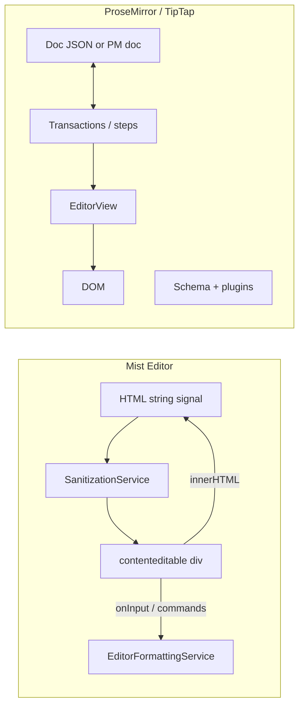

# Mist Editor vs TipTap / ProseMirror

Mist Editor is not universally superior to TipTap or ProseMirror. It is a deliberate, Angular-native tradeoff: HTML-in / contenteditable-out simplicity and Confluence-style UX over ProseMirror’s schema-driven document model. It wins for Angular apps that want tight integration and HTML persistence; ProseMirror wins for extensibility, collaboration, and structural guarantees.

## What Mist Editor is

Mist Editor is a small Angular 21+ library built **from scratch** on:

- A single `contenteditable` surface
- **HTML strings** as the document contract (`content` in → `contentChange` out)
- Browser **Selection/Range** APIs and imperative DOM operations
- Angular **signals** for UI chrome (slash menu, table toolbar)

It does **not** wrap ProseMirror or TipTap. `package.json` lists only `tslib` plus Angular peers—no `@tiptap/*` or `prosemirror-*` packages.



## Architectural comparison

| Dimension | Mist Editor | ProseMirror / TipTap |
|-----------|-------------|----------------------|
| Document model | Mutable DOM + HTML string | Immutable tree + schema |
| Source of truth | `innerHTML` | Document node + transaction log |
| Formatting | `Range.surroundContents`, `replaceChild`, etc. | Commands mapped to document steps |
| Invalid states | Possible; mitigated by sanitization + `onInput` normalization | Schema rules reject invalid structure |
| Extensions | Fixed feature set (slash menu, toolbar) | Plugin/extension ecosystem |
| Collaboration | Not implemented (roadmap) | Yjs / Hocuspocus patterns exist |
| Framework fit | Native Angular (signals, standalone, DI) | TipTap adds framework bindings; core is framework-agnostic |
| Learning curve (Angular devs) | Low—familiar HTML + components | Medium—schema, nodes, marks, commands |

## Where Mist Editor is a better fit

### 1. Angular-native integration

The editor is Angular-first:

- **Inputs/outputs**: `content`, `placeholder`, `contentChange`, `toolbarStateChange`
- **Signals** for overlays: `showCommandMenu`, `selectedTable`, positions
- **`effect()`** syncs external HTML into the editor after sanitization

```typescript
effect(() => {
  if (this.editorElement && this.content()) {
    const editor = this.editorElement.nativeElement;
    const sanitizedContent = this.sanitization.sanitizeEditorContent(this.content());
    if (editor.innerHTML !== sanitizedContent) {
      editor.innerHTML = sanitizedContent;
    }
  }
});
```

Parent apps use idiomatic patterns: `signal<string>` for HTML, `signal<EditorToolbarState>`, `@ViewChild` + `editor.bold()`. No adapter layer or NgZone workarounds for a foreign editor core.

TipTap on Angular requires bridging a ProseMirror `Editor` into Angular change detection; Mist avoids that.

### 2. Minimal dependencies and bundle cost

Peers are Angular only (`@angular/common`, `@angular/core`, `@angular/platform-browser`). TipTap pulls in ProseMirror (`prosemirror-model`, `state`, `view`, `transform`, plus extensions). For Confluence-style editing without custom node types or collaborative cursors, the ProseMirror stack is often unnecessary weight.

### 3. HTML as the persistence contract

Storage, preview, email, and server rendering often need **HTML**, not ProseMirror JSON. Mist’s contract is what you persist: `contentChange` emits sanitized `innerHTML`.

On input, the editor normalizes structure (e.g. wrapping bare text in `<p>`). With ProseMirror you typically keep JSON or a PM doc as truth and maintain a separate HTML serialization pipeline.

### 4. Security built in

`SanitizationService` is a core module with:

- Tag, attribute, and style allowlists tuned for the editor (including `svg` for panel icons)
- Dangerous-pattern stripping (`javascript:`, event handlers, `<script>`, etc.)
- Injectable `SANITIZATION_CONFIG` for app-specific rules
- Dual paths: strict `sanitizeEditorContent` vs `sanitizeTrustedHtml` for app-generated panels and tables

TipTap and ProseMirror can be made safe, but you wire DOMPurify or custom serializers yourself; Mist ships the policy with the library.

### 5. Confluence-style UX without a ProseMirror schema

Out of the box:

- **Slash command menu** (`/` + filter)
- **Callout panels** (info, note, success, error, warning) with mixed `contenteditable` regions
- **Floating table toolbar** (row/column CRUD, alignment, cell background)
- **Code block** exit behavior (double Enter, arrow at end)
- Toolbar styled for Confluence-like workflows

The same in TipTap means custom nodes, node views, and plugins—substantial ProseMirror work that Mist encodes in a focused codebase.

### 6. Modern DOM formatting

Formatting uses explicit DOM APIs (`surroundContents`, unwrap, block replacement)—not deprecated `document.execCommand`. Behavior is predictable for the tags Mist supports.

### 7. Lower cognitive load for Angular maintainers

The codebase is small and navigable: one main editor component, four services, three UI components. Angular teams avoid learning document transforms unless they need them.

## Where TipTap / ProseMirror are better

Mist trades away ProseMirror’s strengths in these areas:

1. **Document integrity** — No formal schema; browsers can produce odd DOM; recovery uses `onInput` heuristics and sanitization, not transactional invariants.

2. **Extensibility** — No plugin API. New block types require editing core components and services.

3. **Collaborative editing** — On the roadmap, not implemented. ProseMirror + Yjs is the common pattern for real-time multi-user editing.

4. **Complex behaviors** — Nested lists, track changes, comments, suggestions, markdown round-tripping, and inline atoms (@mentions as nodes) are easier or only practical with a structured document and steps.

5. **Cross-framework reuse** — TipTap’s core works across React, Vue, and Svelte. Mist is Angular-only.

6. **Testing and ecosystem** — ProseMirror and TipTap have extensive docs, community extensions, and battle-tested edge-case handling.

7. **Accessibility and mobile** — Mobile optimization is on Mist’s roadmap; ProseMirror-based editors often invest more in controlled view layers for keyboard and a11y.

## How Mist implements blocks without ProseMirror

Block behavior is **HTML plus normalization**, not node types:

- On input: wrap bare text in `<p>`; convert stray `div` elements to `<p>` except panels, tables, code blocks, lists, and headings
- Panels: outer `contenteditable="false"`, inner `.panel-content` editable
- `insertBlock()` splits paragraphs at the caret for tables and panels

This is faster to ship but weaker than schema `block*` nodes for Word paste, drag-and-drop, and deeply nested structures.

## Verdict

| Choose Mist Editor when… | Choose TipTap / ProseMirror when… |
|--------------------------|-----------------------------------|
| Angular 21+ app with signals and standalone components | Multi-framework or React/Vue primary |
| HTML storage and API are enough | Strict schema, custom nodes, or JSON document |
| Confluence-like panels, tables, slash menu out of the box | Rich extension marketplace |
| Small bundle, no ProseMirror learning curve | Collaboration, comments, track changes |
| Built-in sanitization policy | Building a general-purpose editor platform |

Mist optimizes **integration simplicity and product UX** for Angular. It is not a general replacement for ProseMirror; it is a **targeted alternative** for apps that need Confluence-style editing with minimal dependencies.

## Code map

| Area | Path |
|------|------|
| Core editor + slash menu | `src/lib/components/rich-text-editor/rich-text-editor.component.ts` |
| Formatting / DOM ops | `src/lib/services/editor-formatting.service.ts` |
| Selection helpers | `src/lib/services/editor-utils.service.ts` |
| Tables | `src/lib/services/table.service.ts` |
| XSS / allowlists | `src/lib/services/sanitization.service.ts` |
| Public API | `src/public-api.ts` |
